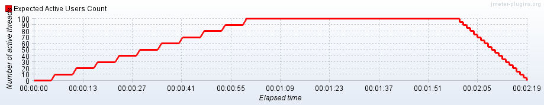

# JMeter

The Apache JMeter is an open-source, purely Java-based software. JMeter is used to perform performance testing, functional testing, and load testing of web applications. It is used to test load testing functional behavior and measuring performance.

<a href="https://jmeter.apache.org/download_jmeter.cgi" target="_blank">Link</a> to download JMeter.

## Here are results of testing using JMeter:

Summary reports resulted from API load testing: loads of <a href="https://github.com/DariaMartinovskaya/JMeter/blob/main/HW_Jmeter_Summary_Report_50.csv">50 threads</a>, <a href="https://github.com/DariaMartinovskaya/JMeter/blob/main/HW_Jmeter_Summary_Report_250.csv">250 threads</a>, <a href="https://github.com/DariaMartinovskaya/JMeter/blob/main/HW_Jmeter_Summary_Report_500.csv">500 threads</a>. Jmeter settings were saved <a href="https://github.com/DariaMartinovskaya/JMeter/blob/main/HW_Jmeter.jmx">here</a>.

<a href="https://github.com/DariaMartinovskaya/JMeter/blob/main/HW2_Jmeter_Summary_Report_Smoke_Onliner.by.csv">Here</a> is a summary report resulted from web-site load testing. Jmeter settings were saved <a href="https://github.com/DariaMartinovskaya/JMeter/blob/main/HW2_Jmeter_Smoke_Onliner.by.jmx">here</a>. 

### The Stepping Thread Group plugin

The Stepping Thread Group plugin of JMeter allows to create a scenario of increasing or maintaining load and find out how much user capacity your system can handle during Apache JMeter load testing. By adding users in steps, we know the exact number of virtual users tested when a bottleneck is discovered. If we test in a linear fashion, it is difficult to determine the precise number of users that causes issues in the system.

<a href="https://github.com/DariaMartinovskaya/JMeter/blob/main/HW2_Jmeter_Summary_Report_Stepping_Thread_Group_plugin.csv">Here</a> is a summary report resulted from using the Stepping Thread Group plugin of JMeter.

And here is the graph of expected active users count:

Jmeter plugin settings were saved <a href="https://github.com/DariaMartinovskaya/JMeter/blob/main/HW2_Jmeter_Stepping_Thread_Group_plugin.jmx">here</a>. 
